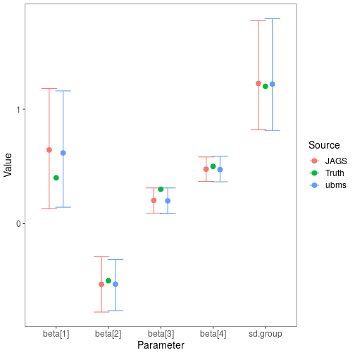

# Introduction

One of the key features of `ubms` is the ability to include random effects in model formulas.
This is not possible in `unmarked`, but it is possible with custom models using [JAGS](http://mcmc-jags.sourceforge.net/).
To explore how estimates of parameters and uncertainty intervals compared between `ubms` and `JAGS`, I simulated a basic occupancy dataset with known parameter values and fit models with both.
In this simulation, individual sites were nested within groups, and I estimated group-level random intercepts.
This is a common scenario for so-called [stacked](https://groups.google.com/forum/#!topic/unmarked/OHkk98y09Zo) data from multiple years, where the "groups" are unique sites and "sites" represent unique site-year combinations.

# Simulating the data

First I set the true parameter values for the vector of fixed effects $\boldsymbol{\beta}$ and the random effects standard deviation $\sigma$.


```r
beta <- c(0.4, -0.5, 0.3, 0.5)
sigma <- 1.2
```

Then, I simulated covariate data for the occupancy and detection submodels.
This included a random group assignment (26 possible groups) for each site.


```r
dat_occ <- data.frame(x1=rnorm(500), group=factor(sample(letters[1:26], 500, replace=T)))
dat_p <- data.frame(x2=rnorm(500*5))
```

Next I simulated the random effect value for each group (with an effects parameterization centered on 0).


```r
re <- rnorm(26, 0, sigma)
```

Finally, I simulated an occupancy dataset `y` using the data and parameter values obtained above.


```r
y <- matrix(NA, 500, 5)
z <- rep(NA, 500)
group_idx <- as.numeric(dat_occ$group) #convert group assignment to numeric index
idx <- 1
for (i in 1:500){
  #True latent state of site i in group group_idx[i]
  z[i] <- rbinom(1,1, plogis(beta[1] + beta[2]*dat_occ$x1[i] + re[group_idx[i]]))
  
  #Observation process
  for (j in 1:5){
    #Observed data at site i for observation j
    y[i,j] <- z[i]*rbinom(1,1, plogis(beta[3] + beta[4]*dat_p$x2[idx]))
    idx <- idx + 1
  }
}
```

# Fitting the model in ubms

I combined the covariates and simulated data into an `unmarkedFrame`.


```r
library(ubms)
umf <- unmarkedFrameOccu(y=y, siteCovs=dat_occ, obsCovs=dat_p)
```

Using `stan_occu`, I fit a model with a random effect of group on occupancy (`(1|group)`).
I probably did not use enough iterations but it's fine for this example.


```r
options(mc.cores=3)
ubms_fit <- stan_occu(~x2~x1+(1|group), umf, chains=3, iter=300)
```


# Fitting the model in JAGS

A bit more work is required to fit this model in JAGS.
First I reorganized the data into a list so it could be sent to JAGS.


```r
nsites <- nrow(umf@y)
jags_data <- list(y=umf@y, x1=dat_occ$x1, group=as.numeric(dat_occ$group),
                  ngroups=nlevels(dat_occ$group),
                  x2=matrix(dat_p$x2, nrow=nsites, byrow=TRUE),
                  nsites=nsites, nobs=ncol(umf@y))
```

Next I wrote a simple occupancy model with group-level intercepts `gint` in the BUGS language, and saved it to a temporary file.


```r
modfile <- tempfile()
writeLines("
model{

#Likelihood
for (i in 1:ngroups){
  gint[i] ~ dnorm(beta[1], tau.group)
}

for (i in 1:nsites){
  z[i] ~ dbern(psi[i])
  logit(psi[i]) <- gint[group[i]] + beta[2]*x1[i]

  for (j in 1:nobs){
    y[i,j] ~ dbern(p[i,j]*z[i])
    logit(p[i,j]) <- beta[3] + beta[4]*x2[i,j]
  }
}

#Priors
for (i in 1:4){
  beta[i] ~ dnorm(0,0.01)
}

sd.group ~ dunif(0,10)
tau.group <- pow(sd.group, -2)

}
", con=modfile)
```

JAGS also requires a list of parameters you want to save, and a function to generate initial values.
Generally you need to provide reasonable initial values for the latent state $z$.
Note that I'm saving both the parameter values (`"beta"` and `"sd.group"`), along with the actual random effects estimates (`"gint"`).

```r
params <- c("beta", "sd.group", "gint")
inits <- function(){list(z=apply(y, 1, max, na.rm=TRUE))}
```

Finally, I fit the model using the R package [jagsUI](https://cran.r-project.org/package=jagsUI).


```r
library(jagsUI)
jags_fit <- jags(jags_data, inits, params, modfile, n.chains=3, n.adapt=100, n.iter=2000,
                 n.burnin=1000, n.thin=2, parallel=TRUE, verbose=FALSE)
```

Running the model in JAGS is significantly slower, although you could speed up by marginalizing the likelihood.

# Compare fixed effect estimates 

With the model fit in both `ubms` and `JAGS`, I compared the fixed effect parameter point estimates and uncertainty intervals visually.


```r
#Data frame of JAGS parameter estimates and UIs
jags_sum <- jags_fit$summary
beta_jags <- as.data.frame(jags_sum[1:5,c(1,3,7)])
names(beta_jags) <- c("mean","lower","upper")
beta_jags$source <- "JAGS"

#Data frame of ubms parameter estimates and UIs
ubms_sum <- summary(ubms_fit, "state")
beta_ubms <- rbind(summary(ubms_fit, "state")[,c(1,4,8)],
                   summary(ubms_fit, "det")[,c(1,4,8)])
beta_ubms <- beta_ubms[c(1:2,4:5,3),]
names(beta_ubms) <- c("mean","lower","upper")
beta_ubms$source <- "ubms"

#Data frame of true parameter values
beta_truth <- data.frame(mean=c(beta, sigma), lower=NA, upper=NA, source="Truth")

#Bind together
beta_plot <- rbind(beta_jags, beta_ubms, beta_truth)
beta_plot$Parameter <- rep(rownames(beta_jags), 3)

#Plot
library(ggplot2)
dodge <- position_dodge(0.4)
ggplot(data=beta_plot, aes(x=Parameter, y=mean, col=source)) +
  geom_errorbar(aes(ymin=lower, ymax=upper), position=dodge) +
  geom_point(position=dodge, size=3) +
  labs(x='Parameter',y='Value', col='Source') +
  theme_bw() +
  theme(panel.grid.major=element_blank(), panel.grid.minor=element_blank(),
        axis.text=element_text(size=12), axis.title=element_text(size=14),
        legend.text=element_text(size=12), legend.title=element_text(size=14))
```



Fixed-effects parameter estimates are very similar between `ubms` and `JAGS`, as are the uncertainty intervals.
In both cases the intervals overlap the true parameter values.

# Compare random effect estimates

Finally, I did the same for the random effect estimates.
The `ranef` method extracts random effects terms from a fitted `ubms` model.
Although we specified the random effect in `ubms` as an "effects" parameterization, `ranef` automatically adds the random effect to the intercept term to get the complete random intercept at the group level. 
The group-level random intercepts in JAGS are parameter `"gint"`.


```r
#Get random effect estimates from ubms
re_ubms <- ranef(ubms_fit, "state", summary=TRUE)[[1]][[1]][,c(1,3,4)]
re_ubms$source <- "ubms"

#Get random effects estimates from JAGS
re_jags <- as.data.frame(jags_sum[grepl("gint", rownames(jags_sum)),c("mean","2.5%","97.5%")])
re_jags$source <- "JAGS"
names(re_jags) <- names(re_ubms)

#Get truth
truth <- data.frame(Estimate=re, `2.5%`=NA, `97.5%`=NA, source="Truth", check.names=FALSE)

#Combine
plot_dat <- rbind(re_ubms, re_jags, truth)
plot_dat$group <- rep(letters[1:26], 3)
levels(plot_dat$source) <- c("Truth","JAGS","ubms")

library(ggplot2)
dodge <- position_dodge(0.4)

#Plot a subset of random effects
plot_dat_sub <- plot_dat[plot_dat$group %in% letters[1:6],]
ggplot(data=plot_dat_sub, aes(x=group, y=Estimate, col=source)) +
  geom_errorbar(aes(ymin=`2.5%`, ymax=`97.5%`), position=dodge) +
  geom_point(position=dodge, size=3) +
  labs(x='Group',y='Random effect value', col='Source') +
  theme_bw() +
  theme(panel.grid.major=element_blank(), panel.grid.minor=element_blank(),
        axis.text=element_text(size=12), axis.title=element_text(size=14),
        legend.text=element_text(size=12), legend.title=element_text(size=14))
```


As with the fixed effects, the estimated random intercepts are very similar between the two methods.
Success!
