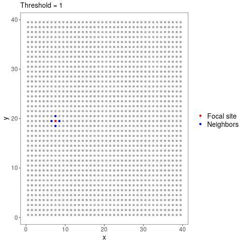
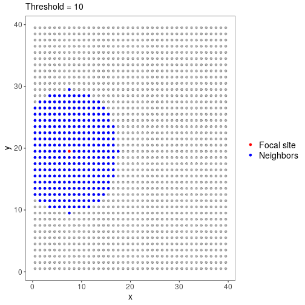
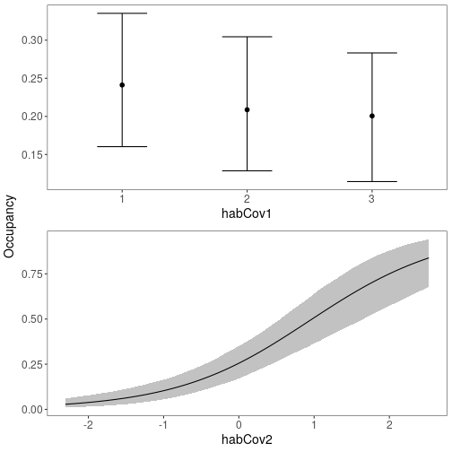
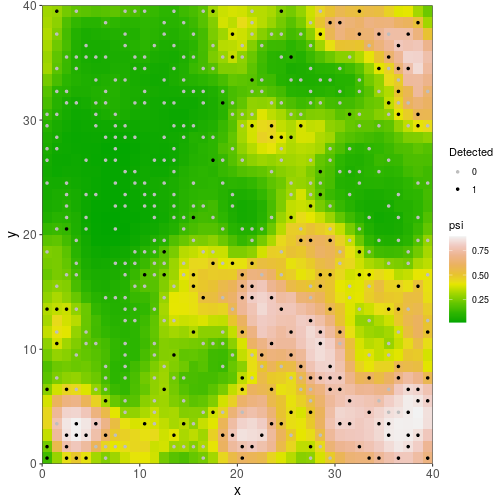
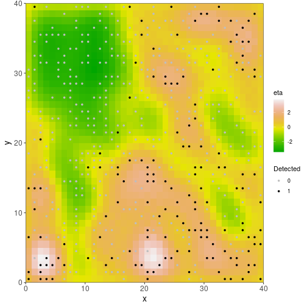

# Introduction

In many studies of animal and plant occurrence and abundance, sites may not be entirely independent.
For example, sites may be close together, or site size may be smaller than a typical home range.
In these cases we expect spatial autocorrelation among nearby sites.
Ideally, this autocorrelation would be accounted for in models.

A solution to this problem is so-called spatial occupancy models, which include spatial random effects.
A common approach to handling spatial autocorrelation is the use of an intrinsic conditional autoregressive (ICAR) random effect [@Banerjee_2014].
The growing accessibility of Bayesian approaches has facilitated fitting these models.
However, fitting ICAR models is computationally intensive and the ICAR random effect may be correlated with fixed covariates included in the model, making inference difficult [@Hodges_2010].
To solve these issues, Johnson et al. [-@Johnson_2013] extended restricted spatial regression (RSR) to occupancy models.
In an RSR model, the random effect is constructed in such a way that it is uncorrelated with the fixed covariates, and it can be significantly less computationally intensive than ICAR to estimate [@Broms_2014].
Broms et al. [@Broms_2014] provide a nice overview of the concepts.
Several recent studies have shown that RSR provides better and faster inference than ICAR [e.g. @Broms_2014; @Clark_2019].
At least two specialized R packages ([`stocc`](https://cran.r-project.org/package=stocc) and [`Rcppocc`](https://github.com/AllanClark/Rcppocc)) are available for fitting ICAR and RSR occupancy models.

It is now possible to fit RSRs in Stan with `ubms` as well, allowing those familiar with `unmarked`/`ubms` syntax and workflows to easily fit spatial models.
Currently all single-season models in `ubms` are supported.
In addition to fitting RSRs, `ubms` also provides tools for applying and visualizing fitted spatial models.
For now these features are available in the dev version of `ubms`, which you can install with the following code:

# Example

We will adapt the demo code and dataset available in R package `stocc` to fit a spatial occupancy model, which will also facilitate a comparison between `stocc` and `ubms` results.
The `stocc` package was an extremely valuable guide when implementing RSRs in `ubms`, and contains many other useful features related to spatial occupancy modeling.


``` r
library(ubms)
library(stocc)
```


## Format the input data

The sample dataset that comes with `stocc` is in long format.
We need to convert it to the wide format that `unmarked` and `ubms` expect.


``` r
# Load datasets
data(habData)   # site covariate data
data(visitData) # observation cov data

# Visits per site
nobs <- table(visitData$site, visitData$obs)

# Dimensions of y matrix
J <- max(nobs)     # max obs per site
M <- nrow(habData) # no. of sites

# Create blank matrices to hold wide-format versions
y <- detCov1 <- detCov2 <- matrix(NA, nrow=M, ncol=J)

# Iterate over sites
for (i in 1:M){
  # Data from site i
  sub <- visitData[visitData$site==i,]
  # Put this data into our wide matrices
  subJ <- nrow(sub)
  if(subJ == 0) next
  y[i,1:subJ] <- sub$obs
  detCov1[i,1:subJ] <- sub$detCov1
  detCov2[i,1:subJ] <- as.character(sub$detCov2)
}

# Make site and obs cov data frames
site_cov <- habData
obs_cov <- data.frame(detCov1=as.vector(t(detCov1)), detCov2=as.vector(t(detCov2)))

# Convert detCov2 back into a factor (as it was originally)
obs_cov$detCov2 <- factor(obs_cov$detCov2, levels=c("0","1","2","3"))
```

In order to fit a spatial model, we need coordinates included in our site covariates.
These should be in some projected coordinate system.
In this dataset, coordinates are contained in columns `x` and `y`:


``` r
head(site_cov)
```

```
##   site   x   y habCov1    habCov2
## 1    1 0.5 0.5       1 -1.4189386
## 2    2 0.5 1.5       1 -1.4081437
## 3    3 0.5 2.5       1 -1.1183479
## 4    4 0.5 3.5       1 -0.7852142
## 5    5 0.5 4.5       1 -0.6260133
## 6    6 0.5 5.5       1 -0.6122186
```

Site and observation covariates are otherwise handled the same way as normal for `unmarked` and `ubms` models.
Here's a quick visualization of how `habCov2` varies across the study area.


``` r
library(ggplot2)
#Which sites were sampled at least once?
sampled <- apply(y, 1, function(x) any(!is.na(x)))

ggplot(data=site_cov, aes(x=x, y=y)) +
  geom_tile(aes(fill=habCov2)) +
  geom_point(data=site_cov[sampled,], size=0.5) +
  scale_fill_gradientn(colors=heat.colors(10)) +
  theme_bw(base_size=12) + 
  theme(panel.grid=element_blank())
```


The black dots represent locations that were sampled at least once.
Note that not all grid cells with available site covariates were actually sampled; in fact most of them were not.
For typical models, `ubms` would just ignore a site that was present in the dataset but never sampled (i.e., `y` all `NA`) since these sites cannot contribute any information.
However for spatial models, generating predictive maps across areas that may not have been sampled is a typical goal.
To facilitate this, spatial models in `ubms` do not discard sites which were never sampled but that have available site covariates.
As you'd expect, you simply include these by including a row of all missing values in `y` and your observation covariates, as appropriate.
For example, in this dataset, sites 1 and 2 were sampled but site 3 was not:


``` r
y[1:3,]
```

```
##      [,1] [,2] [,3] [,4] [,5] [,6] [,7]
## [1,]    1    1    1    1   NA   NA   NA
## [2,]    1    1    1   NA   NA   NA   NA
## [3,]   NA   NA   NA   NA   NA   NA   NA
```

``` r
round(detCov1[1:3,],3)
```

```
##        [,1]   [,2]   [,3]   [,4] [,5] [,6] [,7]
## [1,]  1.474 -0.220  1.112 -1.254   NA   NA   NA
## [2,] -1.602  1.349 -0.690     NA   NA   NA   NA
## [3,]     NA     NA     NA     NA   NA   NA   NA
```

The final step in data formatting is to construct the `unmarkedFrame`.


``` r
umf <- unmarkedFrameOccu(y=y, siteCovs=site_cov, obsCovs=obs_cov)
```

## Choose RSR options

Next, we need to decide on settings for the RSR.
Specifically, we need to decide the distance threshold below which two sites will be considered neighbors and thus potentially correlated with each other.
For example, if site A and site B are 0.5 distance units apart and we set the threshold at 1, A and B will be considered neighbors.
If A and B are 1.5 distance units apart, they will not be neighbors.
The distance units are defined by the units of the coordinates you provided.

To visualize this, we can use the `RSR()` function, which we will use again later when fitting the model.
The RSR() function requires as input at least one coordinate vector (typically you will have 2, e.g. `x` and `y`) and a value for the `threshold` argument.
If we set the `plot_site` argument to an integer, `RSR` will return a map highlighting that site and its neighbors under the current threshold setting:


``` r
with(site_cov, RSR(x, y, threshold=1, plot_site=300))
```



With `threshold=1` and our coordinate grid, site 300 has just 4 neighbors. 
Now consider `threshold=10`:


``` r
with(site_cov, RSR(x, y, threshold=10, plot_site=300))
```



The threshold choice depends on your modeling goals and study system, but it is probably best to start with sites having a relatively small number of neighbors.
We will set `threshold=1` for this example.

A final argument available in `RSR()` is `moran_cut`.
This option controls the number of eigenvectors that are used when calculating the spatial random effect (possible values are 1 to the number of sites).
Generally, with fewer eigenvectors, the model will run faster and the result will be smoother.
Previous studies have shown that inference is not particularly sensitive to this value, and recommended it be set to 10% of the number of sites [@Broms_2014; @Clark_2019].
This is the default in `ubms` so we will leave it alone.

## Fit the model

We are finally ready to fit our spatial model.
The formula syntax is identical to normal `ubms` and (and `unmarked`) models, except that we will include a call to `RSR()` with our desired options in our formula for `psi`.
We also include two fixed detection and two fixed occupancy covariates.


``` r
#Double formula: first part is for detection, second for occupancy
form <- ~detCov1 + detCov2 ~habCov1 + habCov2 + RSR(x, y, threshold=1)
```

We will then fit the model in Stan with `stan_occu()`, using 3 parallel cores.
This will take Stan a few minutes with default MCMC settings.


``` r
fit_ubms <- stan_occu(form, umf, chains=3, cores=3, seed=123)
```


You will likely get some warnings about effective sample size.
The solution is to run the model for more iterations, but this is good enough for an example.

## Examine results

Look at the parameter estimates:


``` r
fit_ubms
```

```
## 
## Call:
## stan_occu(formula = form, data = umf, chains = 3, refresh = 0, 
##     cores = 3, seed = 123)
## 
## Occupancy (logit-scale):
##             Estimate     SD   2.5%  97.5% n_eff  Rhat
## (Intercept)   -1.056 0.2236 -1.509 -0.635  1542 1.002
## habCov12      -0.215 0.3128 -0.832  0.384  2339 0.999
## habCov13      -0.261 0.3221 -0.886  0.375  2121 0.999
## habCov2        1.090 0.1705  0.771  1.434  1389 1.001
## RSR [tau]      0.144 0.0529  0.071  0.276   248 1.006
## 
## Detection (logit-scale):
##             Estimate    SD   2.5% 97.5% n_eff  Rhat
## (Intercept)    1.736 0.375  1.038 2.532  1806 1.000
## detCov1        0.109 0.214 -0.293 0.510  4609 1.000
## detCov21       1.175 0.544  0.160 2.278  2263 1.000
## detCov22       1.363 0.580  0.246 2.559  2331 1.000
## detCov23      -0.249 0.488 -1.235 0.714  2234 0.999
## 
## LOOIC: 668.831
## Runtime: 2.036 min
```

The precision term (tau, $\tau$) associated with the spatial random effect is the final row of the occupancy model estimates.
Smaller values of $\tau$ imply greater variability in the spatial random effect.

There also appears to be a strong effect of `habCov2` on occupancy.
We can quickly visualize marginal effects of fixed covariates with `plot_effects`.


``` r
plot_effects(fit_ubms, "state")
```



You can extract predicted occupancy values for each site (including sites never actually sampled) using the `predict` function:


``` r
# "state" to get state/occupancy process, as opposed to "det"
psi <- predict(fit_ubms, "state")
head(psi)
```

```
##   Predicted         SD       2.5%     97.5%
## 1 0.1431907 0.04554381 0.06928728 0.2453479
## 2 0.2378141 0.08682981 0.10409517 0.4370658
## 3 0.3617458 0.11947600 0.16084996 0.6211602
## 4 0.4577439 0.12923964 0.22673143 0.7246516
## 5 0.4549725 0.12532278 0.22459356 0.7163457
## 6 0.3863041 0.11822055 0.17525150 0.6382941
```

## Plotting

It is much more interesting to see how predicted occupancy varies across the study area.
`ubms` has a built-in function for generating such a map, `plot_spatial`.


``` r
plot_spatial(fit_ubms)
```



The plot also shows the location of sampled sites and whether the species was ever detected at each one.

You can also look at the spatial distribution of random effects $\eta$:


``` r
plot_spatial(fit_ubms, "eta")
```



## Model selection

It is important to confirm that the spatial random effect is actually improving the predictive power of the model; if it isn't, we ought to remove it.
To check this, first fit a similar model without the RSR:

``` r
fit_nonspatial <- stan_occu(~detCov1 + detCov2 ~habCov1 + habCov2, umf,
                            chains=3, seed=123)
```


Combine the models to compare into a `fitList` (note: they must have the same number of chains and MCMC iterations):


``` r
fl <- fitList(fit_ubms, fit_nonspatial)
```

Then, compare the spatial and non-spatial models with leave-one-out cross-validation (LOO)[@Vehtari_2017] using the `modSel()` function:


``` r
round(modSel(fl),2)
```

```
##                   elpd nparam elpd_diff se_diff
## fit_ubms       -334.42  46.18      0.00    0.00
## fit_nonspatial -380.45   8.34    -46.04    8.25
```

A measure of predictive accuracy (`elpd`) is shown for each model, and the model with the highest predictive accuracy is listed first.
The difference in `elpd` between the top and model and each subsequent model (`elpd_diff`), along with a measure of the uncertainty of that difference (`se_diff`), are also shown.
If the magnitude of `elpd_diff` is large relative to the associated uncertainty, we can conclude that there is a difference in predictive power between the two models.
In this case `elpd_diff` between the spatial (`fit_ubms`) and non-spatial (`fit_nonspatial`) models is several times the size of `se_diff`, so including the spatial random effect appears to improve model predictive accuracy.


# Compare with stocc

The implementation of spatial models in `ubms` owes much to the `stocc` package.
The two packages give essentially identical results.
To show this, we will fit the same model in `stocc` and compare the occupancy predictions with `ubms`.
The code for fitting the model in `stocc` is taken directly from the package demo.


``` r
set.seed(123)
names <- list(
  visit=list(site="site",obs="obs"),
  site=list(site="site", coords=c("x","y"))
  )

fit_stocc <- spatial.occupancy(
  detection.model = ~ detCov1 + detCov2,
  occupancy.model = ~ habCov1 + habCov2,
  spatial.model = list(model="rsr", threshold=1.01, moran.cut=0.1*nrow(habData)),
  so.data = make.so.data(visitData, habData, names),
  prior = list(a.tau=0.5, b.tau=0.00005, Q.b=0.1, Q.g=0.1),
  control = list(burnin=1000/5, iter=4000/5, thin=5)
  )
```


Here's a similar plot of predicted occupancy across the study area:


``` r
# Predicted occupancy
psi_stocc <- fit_stocc$occupancy.df$psi.est

# Sites that were sampled at least once
sampled <- apply(getY(umf), 1, function(x) any(!is.na(x)))
plot_data <- cbind(habData, psi=psi_stocc)

ggplot(data=plot_data, aes(x=x,y=y)) +
  geom_point(aes(col=psi), size=5, pch=15) +
  scale_color_gradientn(colors=terrain.colors(10)) +
  geom_point(data=plot_data[sampled,],aes(x=x,y=y), size=0.5) +
  labs(col="psi") +
  theme_bw(base_size=12) +
  theme(panel.grid=element_blank(),
        strip.background=element_rect("white"))
```


As you can see, the predicted occupancy maps for `ubms` and `stocc` are almost identical.
Note, however, that coefficient estimates may not be identical because `stocc` uses a probit link function, while `ubms` uses a logit link.

# References

<div id="refs"></div>
